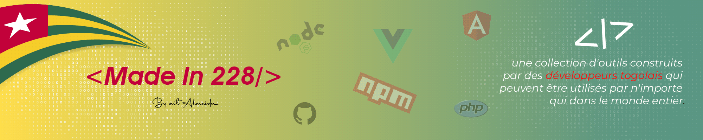

<h1 align="center">
  
   
  <a href="#" target="blank_">Made In 228</a>
</h1>

👨🏽‍💻 Il s'agit d'une collection d'outils construits par des développeurs togolais qui peuvent être utilisés par n'importe qui dans le monde entier.🌍

---

Si vous êtes le mainteneur d'un projet, vous pouvez ajouter notre badge en copiant le code ci-dessous ⬇️ dans la description de votre projet GitHub.

<pre align="center">
  <code>
  
  </code>
</pre>

🚧 Si voulez contribuer sur ce projet veuillez lire ceci <strong><a href="https://github.com/aitAlmeida/made.in.228/blob/main/CONTRIBUTING.md">CONTRIBUTING.md</a></strong> en premier !

<a href="#A">A</a> | <a href="#B">B</a> | <a href="#C">C</a> | <a href="#D">D</a> | <a href="#E">E</a> | 
<a href="#F">F</a> | <a href="#G">G</a> | <a href="#H">H</a> | <a href="#I">I</a> | <a href="#J">J</a> | 
<a href="#K">K</a> | <a href="#L">L</a> | <a href="#M">M</a> | <a href="#N">N</a> | <a href="#O">O</a> | 
<a href="#P">P</a> | <a href="#Q">Q</a> | <a href="#R">R</a> | <a href="#S">S</a> | <a href="#T">T</a> | 
<a href="#U">U</a> | <a href="#V">V</a> | <a href="#W">W</a> | <a href="#X">X</a> | <a href="#Y">Y</a> | 
<a href="#Z">Z</a>

## A

## B

## C

## D

## E

## F

- **[FingerPrintXamarin](https://github.com/egbakou/FingerPrintXamarin)** - Fingerprint authentication example in Xamarin.Forms. 
**by [@egbakou](https://github.com/egbakou/egbakou)**
**[lioncoding.com](https://lioncoding.com/)**

- **[flutter_paygateglobal](https://github.com/bienvenuelisis/flutter_paygateglobal)** - Integrate easily the Paygate Global Platform into your Flutter app. **by [@ bienvenuelisis](https://github.com/bienvenuelisis/bienvenuelisis)** 

## G

## I

- **[inspi_quotes](https://github.com/Ethiel97/inspi_quotes)** - Flutter mobile app to display quotes **by [@Ethiel97](https://github.com/Ethiel97/Ethiel97)**

## W

- **[wallify](https://github.com/Ethiel97/wallify)** - wallpaper mobile app built with Flutter. **by [@Ethiel97](https://github.com/Ethiel97/Ethiel97)**

